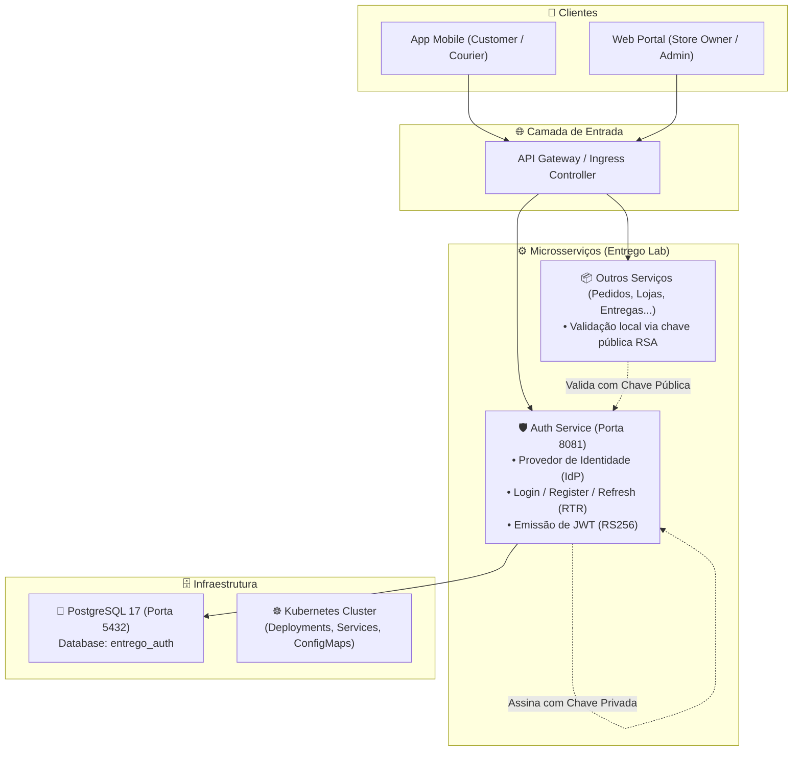

# 📦 Entrego Lab

> **Ecossistema de Microsserviços e Laboratório de Engenharia para a Plataforma Entrego**

[](https://www.oracle.com/java/)
[](https://spring.io/projects/spring-boot)
[](https://www.postgresql.org/)
[](https://www.docker.com/)
[](https://kubernetes.io/)
[](https://flywaydb.org/)

---

## 📑 Sumário

- [Visão Geral](#-visão-geral)
- [Arquitetura do Ecossistema](#-arquitetura-do-ecossistema)
  - [Autenticação e Confiança Distribuída (RSA RS256)](#autenticação-e-confiança-distribuída-rsa-rs256)
- [Estrutura do Repositório](#-estrutura-do-repositório)
- [Catálogo de Microsserviços](#-catálogo-de-microsserviços)
  - [Auth Service](#-auth-service)
- [Infraestrutura e Orquestração](#-infraestrutura-e-orquestração)
  - [Docker Compose Local](#docker-compose-local)
  - [Kubernetes](#kubernetes)
- [Pré-requisitos e Como Executar](#-pré-requisitos-e-como-executar)
  - [1. Subir a Infraestrutura Base](#1-subir-a-infraestrutura-base)
  - [2. Executar os Serviços](#2-executar-os-serviços)
  - [3. Testar a Conexão](#3-testar-a-conexão)
- [Padrões de Engenharia e Segurança](#-padrões-de-engenharia-e-segurança)
- [Documentação Detalhada](#-documentação-detalhada)
- [Roadmap de Evolução](#-roadmap-de-evolução)

---

## 🎯 Visão Geral

O **Entrego Lab** é o repositório monorepo / laboratório de microsserviços do ecossistema **Entrego**, uma plataforma de entregas e intermediação logística desenhada para alta escala, desacoplamento e resiliência.

O projeto foi concebido seguindo princípios de arquitetura corporativa moderna:
- **Separação de Preocupações (SoC)** por microsserviços autônomos.
- **Autenticação Descentralizada**: Tokens JWT assinados com par de chaves assimétricas RSA (RS256), permitindo que os serviços consumidores validem requisições de forma local e stateless, sem acoplamento temporal ao serviço de autenticação.
- **Segurança em Camadas**: Hashes de senha com BCrypt, rotação estrita de refresh tokens (RTR) com armazenamento criptografado em repouso (SHA-256) e RBAC nativo.
- **Infraestrutura Imutável e Declarativa**: Ambientes locais reprodutíveis via Docker Compose e preparação para clusterização via Kubernetes.

---

## 🏛️ Arquitetura do Ecossistema



### Autenticação e Confiança Distribuída (RSA RS256)

1. **`auth-service`**: Mantém a **chave privada RSA (`private.pem`)**. Ao autenticar um usuário, emite um Access Token JWT auto-contido assinado digitalmente.
2. **Demais Microsserviços**: Possuem apenas a **chave pública RSA (`public.pem`)**. Eles validam a autenticidade e as permissões (`roles`) dos tokens de forma offline, garantindo latência próxima a zero e total tolerância a falhas na comunicação entre microsserviços.

---

## 📂 Estrutura do Repositório

```text
entrego-lab/
├── README.md                  # Visão geral e guia mestre do ecossistema (este arquivo)
├── infraestructure/           # Configurações de infraestrutura local
│   ├── compose.yaml           # Docker Compose com PostgreSQL 17 e persistência
│   ├── .env.example           # Modelo de variáveis de ambiente
│   └── init-scripts/          # Scripts SQL de inicialização de bancos de dados
│       └── init-test-db.sql   # Provisionamento automático do banco entrego_auth_test
├── kubernetes/                # Manifests de orquestração para cluster K8s
│   └── (manifests em evolução)
└── services/                  # Microsserviços da plataforma Entrego
    └── auth-service/          # Microsserviço de Identidade, Autenticação e RBAC
        ├── pom.xml            # Dependências Maven (Java 21, Spring Boot 4.1.1)
        ├── README.md          # Documentação central do Auth Service
        ├── docs/              # Guias técnicos especializados
        │   ├── api-endpoints.md
        │   ├── architecture-and-structure.md
        │   ├── database-and-migrations.md
        │   ├── error-handling.md
        │   └── security-and-jwt.md
        └── src/               # Código-fonte, testes e recursos
```

---

## 🧩 Catálogo de Microsserviços

| Microsserviço | Diretório | Porta Padrão | Stack | Descrição | Status |
| :--- | :--- | :--- | :--- | :--- | :--- |
| **Auth Service** | [`services/auth-service`](services/auth-service) | `8081` | Java 21, Spring Boot 4, Security, JWT (RS256), Flyway | Gestão de identidade, controle de papéis (`CUSTOMER`, `STORE_OWNER`, `ADMIN`), login, logout e refresh token rotation. | `Ativo` |
| **Order Service** | `services/order-service` | `8082` | *Planejado* | Gestão de ciclo de vida de pedidos, carrinhos e status de entrega. | *Backlog* |
| **Restaurant / Store Service** | `services/store-service` | `8083` | *Planejado* | Cadastro de estabelecimentos parceiros, cardápios e produtos. | *Backlog* |
| **Delivery Service** | `services/delivery-service` | `8084` | *Planejado* | Roteirização, geolocalização e alocação de entregadores parceiros. | *Backlog* |

### 🛡️ Auth Service
O serviço de autenticação é a fundação de segurança da plataforma:
- **Assinatura Assimétrica**: RS256 com chave RSA de 2048 bits.
- **Refresh Token Rotation (RTR)**: Tokens de longa duração rotacionados a cada uso, com armazenamento exclusivamente em hash SHA-256.
- **Papéis do Sistema (RBAC)**: Suporte a `CUSTOMER`, `STORE_OWNER` e `ADMIN`.
- **Versionamento de Banco**: Flyway gerenciando tabelas `users`, `roles`, `user_roles` e `refresh_tokens`.

Para detalhes completos de APIs, consulte a [Documentação de Endpoints do Auth Service](services/auth-service/docs/api-endpoints.md).

---

## 🐳 Infraestrutura e Orquestração

### Docker Compose Local

O diretório [`infraestructure/`](infraestructure/) disponibiliza os containers necessários para o desenvolvimento local.

| Recurso | Imagem | Porta Externa | Detalhes |
| :--- | :--- | :--- | :--- |
| **PostgreSQL** | `postgres:17` | `5432` | Banco de dados relacional (`entrego_auth`) com volume nomeado `postgres_data` |

### Kubernetes

O diretório [`kubernetes/`](kubernetes/) é reservado para os manifests e Helm Charts responsáveis pela implantação em ambientes de staging e produção:
- Deployments e ReplicaSets dos microsserviços.
- ConfigMaps e Secrets para injeção de credenciais e chaves RSA.
- Ingress Rules e Services para roteamento de tráfego interno e externo.

---

## 🚀 Pré-requisitos e Como Executar

### Pré-requisitos
- **Java JDK 21+** instalado.
- **Docker** e **Docker Compose** instalados e em execução.
- Gerenciador de requisições HTTP (cURL, Postman ou HTTPie).

---

### 1. Subir a Infraestrutura Base

No terminal, navegue até a pasta de infraestrutura e inicie os containers em segundo plano:

```powershell
cd infraestructure
docker compose up -d
```

Verifique se o banco PostgreSQL está saudável:

```powershell
docker compose ps
```

---

### 2. Executar os Serviços

#### Executando o `auth-service`:

```powershell
cd ../services/auth-service
./mvnw spring-boot:run
```

O serviço iniciará na porta **`8081`**, aplicando automaticamente as migrações do Flyway no PostgreSQL.

---

### 3. Testar a Conexão

#### Criar um novo usuário:
```bash
curl -i -X POST http://localhost:8081/auth/register \
  -H "Content-Type: application/json" \
  -d '{
    "name": "Icaro Teodoro",
    "email": "icaro@entrego.com",
    "password": "SenhaSegura123!"
  }'
```

#### Efetuar login:
```bash
curl -i -X POST http://localhost:8081/auth/login \
  -H "Content-Type: application/json" \
  -d '{
    "email": "icaro@entrego.com",
    "password": "SenhaSegura123!"
  }'
```

---

## 🔒 Padrões de Engenharia e Segurança

- **Zero Trust & Principio do Menor Privilégio**: Comunicação inter-serviços autenticada e papéis RBAC validados explicitamente via anotações `@PreAuthorize`.
- **Imutabilidade e Records**: Todos os DTOs e payloads utilizam Java Records para garantia de imutabilidade e consistência.
- **Defesa em Profundidade**:
  - Senhas hasheadas via `BCryptPasswordEncoder`.
  - Refresh Tokens gerados via `SecureRandom` e persistidos apenas como hash **SHA-256**.
  - Invalidação imediata do token antigo no fluxo de renovação.
- **Migrações Determinísticas**: Modificações no schema relacional passam obrigatoriamente por scripts SQL versionados com Flyway (`ddl-auto: validate`).

---

## 📚 Documentação Detalhada

A documentação detalhada de cada domínio está organizada e versionada junto ao código:

- 📖 [**Auth Service - README Completo**](services/auth-service/README.md)
- 🏗️ [**Arquitetura, Pacotes e Spring Beans**](services/auth-service/docs/architecture-and-structure.md)
- 🔐 [**Segurança, JWT Assimétrico e Ciclo RTR**](services/auth-service/docs/security-and-jwt.md)
- 📡 [**Especificação de Endpoints e Exemplos cURL**](services/auth-service/docs/api-endpoints.md)
- 🗄️ [**Modelo Relacional e Migrações Flyway**](services/auth-service/docs/database-and-migrations.md)
- 🚨 [**Tratamento de Exceções e Respostas de Erro**](services/auth-service/docs/error-handling.md)

---

## 🗺️ Roadmap de Evolução

- [x] Criação da infraestrutura PostgreSQL 17 via Docker Compose.
- [x] Implementação do `auth-service` (Java 21, Spring Boot 4, JWT RS256, Flyway, RTR, RBAC).
- [ ] Implementação de Service Discovery ou API Gateway (Spring Cloud Gateway / Envoy).
- [ ] Criação dos microsserviços de catálogo de lojas e cardápio.
- [ ] Criação do microsserviço de pedidos e orquestração de transações distribuídas (Saga / Outbox Pattern).
- [ ] Mensageria com Apache Kafka ou RabbitMQ para eventos assíncronos.
- [ ] Manifests Kubernetes (Deployments, Services, ConfigMaps, Secrets, Ingress).
- [ ] Pipelines CI/CD com GitHub Actions para automação de testes e build de imagens OCI.

---

<p align="center">
  <b>Entrego Lab</b> &bull; Desenvolvido por <a href="https://github.com/icaroteodoro">Ícaro Teodoro</a>
</p>
