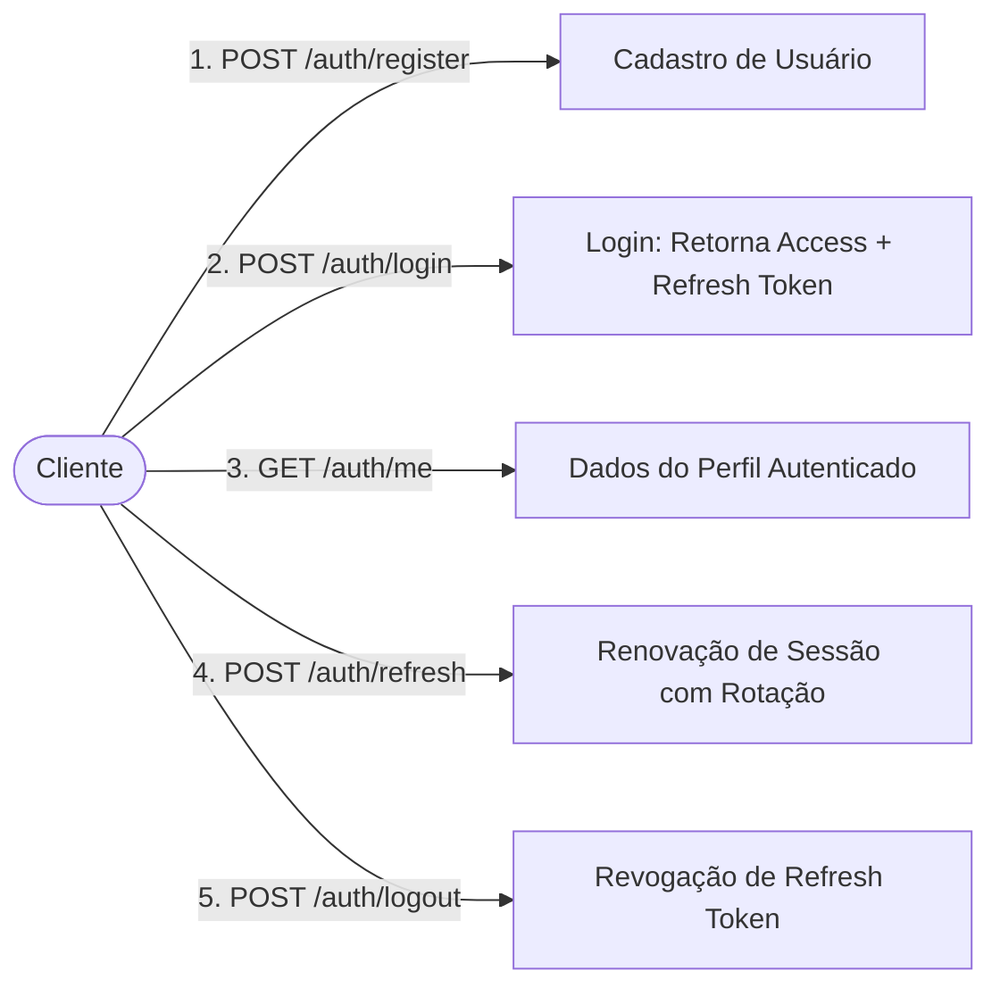

# 🛡️ Auth Service - Entrego Lab

Microsserviço de Identidade, Autenticação e Autorização do ecossistema **Entrego**. Desenvolvido com **Java 21**, **Spring Boot 4.x**, **Spring Security**, autenticação stateless assimétrica via **JWT (RSA RS256)**, **Refresh Token Rotation (RTR)** com hashing SHA-256 e persistência em **PostgreSQL 17** gerenciada via **Flyway**.

---

## 📑 Sumário

- [Visão Geral](#-visão-geral)
- [Stack Tecnológica](#-stack-tecnológica)
- [Mapa da Documentação Técnica](#-mapa-da-documentação-técnica)
- [Estrutura do Código e Módulos](#-estrutura-do-código-e-módulos)
- [Decisões Arquiteturais e de Segurança](#-decisões-arquiteturais-e-de-segurança)
  - [Autenticação Assimétrica com Par de Chaves RSA](#1-autenticação-assimétrica-com-par-de-chaves-rsa)
  - [Proteção de Senhas com BCrypt](#2-proteção-de-senhas-com-bcrypt)
  - [Controle de Acesso Baseado em Papéis (RBAC)](#3-controle-de-acesso-baseado-em-papéis-rbac)
  - [Refresh Token com Rotação (RTR) e Hashing em Repouso](#4-refresh-token-com-rotação-rtr-e-hashing-em-repouso)
- [Catálogo de Componentes Spring](#-catálogo-de-componentes-spring)
- [Guia de Endpoints da API](#-guia-de-endpoints-da-api)
- [Tratamento de Exceções e Erros HTTP](#-tratamento-de-exceções-e-erros-http)
- [Configurações do Ambiente](#-configurações-do-ambiente)
- [Como Executar a Aplicação](#-como-executar-a-aplicação)

---

## 🎯 Visão Geral

O **Auth Service** atua como o **Servidor de Autorização e Provedor de Identidade (IdP)** da plataforma Entrego. Ele é responsável por:
1. **Cadastro e Gestão de Usuários**: Registro de contas com validação de unicidade de e-mail e atribuição inicial de papel `CUSTOMER`.
2. **Autenticação Segura**: Verificação de credenciais e emissão de tokens de acesso JWT assinados digitalmente.
3. **Emissão e Rotação de Refresh Tokens**: Manutenção segura da sessão do usuário sem exigir novas credenciais por até 30 dias.
4. **Introspecção de Perfil e Autorização (RBAC)**: Validação de perfis (`CUSTOMER`, `STORE_OWNER`, `ADMIN`) para consumo interno e por outros microsserviços.

---

## 🚀 Stack Tecnológica

| Componente | Tecnologia | Versão | Finalidade |
| :--- | :--- | :--- | :--- |
| **Linguagem** | Java | 21 (LTS) | Plataforma de execução com Records e recursos modernos |
| **Framework** | Spring Boot | 4.1.1 | Framework base para microsserviços |
| **Segurança** | Spring Security | 6.x / 7.x | Controle de segurança, filtros stateless e RBAC |
| **OAuth2 / JWT** | Spring OAuth2 Resource Server & Nimbus JOSE | Integrado | Codificação e decodificação de JWTs via RSA (RS256) |
| **Persistência** | Spring Data JPA & Hibernate | Integrado | Mapeamento Objeto-Relacional (ORM) |
| **Banco de Dados**| PostgreSQL | 17 | SGBD relacional de produção |
| **Migrações** | Flyway (`flyway-database-postgresql`) | Integrado | Versionamento de schema de banco de dados |
| **Validação** | Spring Boot Starter Validation (Hibernate Validator) | Integrado | Validação declarativa via Bean Validation |
| **Utilitários** | Project Lombok | Integrado | Geração de getters, setters e construtores |

---

## 📚 Mapa da Documentação Técnica

Para facilitar o aprofundamento em cada parte da arquitetura, a documentação está modularizada dentro do diretório [`docs/`](docs/):

- 🏗️ [**docs/architecture-and-structure.md**](docs/architecture-and-structure.md): Decomposição detalhada dos pacotes, classes, catálogo completo de Beans, Services, Repositories, Enums e diagrama de classes.
- 🔐 [**docs/security-and-jwt.md**](docs/security-and-jwt.md): Detalhamento do par de chaves RSA assimétricas, formato do JWT, modelo RBAC, segurança do BCrypt, algoritmo de rotação (RTR) e diagramas de sequência.
- 📡 [**docs/api-endpoints.md**](docs/api-endpoints.md): Especificação completa de cada rota HTTP com payloads de requisição/resposta, headers e comandos `curl`.
- 🚨 [**docs/error-handling.md**](docs/error-handling.md): Estrutura padronizada de falhas (`ApiError`), mapeamento de exceções e respostas HTTP.
- 🗄️ [**docs/database-and-migrations.md**](docs/database-and-migrations.md): Modelo relacional, script de migração Flyway, diagramas ER e dicionário das tabelas.

---

## 📂 Estrutura do Código e Módulos

O código está estruturado em pacotes coesos sob o namespace `br.com.icaroteodoro.entrego.auth`:

```text
br.com.icaroteodoro.entrego.auth/
├── AuthServiceApplication.java         # Ponto de inicialização do Spring Boot
├── auth/                               # Módulo de Autenticação (Login, Refresh, Logout, Me)
│   ├── AuthController.java             # Endpoints /auth/login, /auth/refresh, etc.
│   ├── AuthService.java                # Lógica central de autenticação e emissão de tokens
│   └── dtos/                           # DTOs de autenticação (Login, Refresh, Me, Logout)
├── exceptions/                         # Tratamento centralizado de erros
│   ├── ApiError.java                   # Payload padrão de retorno para erros da API
│   ├── GlobalExceptionHandler.java     # Interceptor @RestControllerAdvice
│   └── InvalidRefreshTokenException.java # Exceção para tokens inválidos/expirados
├── role/                               # Controle de Acesso Baseado em Papéis (RBAC)
│   ├── Role.java                       # Entidade JPA da tabela 'roles'
│   ├── RoleName.java                   # Enum de papéis: CUSTOMER, STORE_OWNER, ADMIN
│   └── RoleRepository.java             # Repositório JPA para busca de papéis
├── security/                           # Infraestrutura de Segurança e Criptografia
│   ├── JwtConfig.java                  # Declaração dos Beans de chaves RSA e Nimbus
│   ├── JwtProperties.java              # Record com propriedades tipadas security.jwt
│   ├── JwtService.java                 # Geração e assinatura de JWT com chave privada
│   └── SecurityConfig.java             # Configuração da cadeia de filtros do Spring Security
├── token/                              # Ciclo de Vida do Refresh Token
│   ├── RefreshToken.java               # Entidade JPA da tabela 'refresh_tokens'
│   ├── RefreshTokenRepository.java     # Busca de tokens pelo hash SHA-256
│   └── RefreshTokenService.java        # Geração aleatória com SecureRandom e hash SHA-256
└── user/                               # Domínio e Gestão de Usuários
    ├── User.java                       # Entidade JPA da tabela 'users'
    ├── UserController.java             # Endpoint /auth/register
    ├── UserRepository.java             # Repositório JPA para operações com usuários
    ├── UserService.java                # Lógica de criação de contas com senha BCrypt
    ├── UserStatus.java                 # Enum de status da conta: ACTIVE, BLOCKED, etc.
    └── dtos/                           # DTOs de cadastro e resposta de usuário
```

---

## 🔒 Decisões Arquiteturais e de Segurança

### 1. Autenticação Assimétrica com Par de Chaves RSA
Ao contrário de modelos simétricos (HMAC / secret compartilhado), o serviço utiliza **par de chaves RSA 2048 bits (algoritmo RS256)**:
- **`private.pem`**: Fica **exclusivamente** no `auth-service` para assinar digitalmente os Access Tokens emitidos.
- **`public.pem`**: Pode ser distribuída para qualquer microsserviço consumidor do ecossistema Entrego.
- **Benefício**: Os demais serviços validam os tokens **localmente com latência zero**, sem necessidade de consultar o `auth-service` a cada requisição e sem risco de vazamento da chave de assinatura.

### 2. Proteção de Senhas com BCrypt
Senhas são transformadas em hashes via `BCryptPasswordEncoder`. O algoritmo embute automaticamente um salt aleatório para cada hash e possui fator de trabalho computacionalmente resistente a ataques por dicionário ou tabelas rainbow.

### 3. Controle de Acesso Baseado em Papéis (RBAC)
- Os papéis dos usuários (`RoleName`) são incluídos no claim `"roles"` do JWT.
- O `JwtAuthenticationConverter` no `SecurityConfig` adiciona o prefixo `ROLE_`, integrando-se perfeitamente com a anotação `@PreAuthorize("hasRole('...')")`.
- Papéis disponíveis no sistema:
  - `CUSTOMER`: Cliente final consumidor.
  - `STORE_OWNER`: Lojista ou estabelecimento parceiro.
  - `ADMIN`: Administrador com permissões operacionais completas.

### 4. Refresh Token com Rotação (RTR) e Hashing em Repouso
- **Geração Segura**: 32 bytes de alta entropia via `SecureRandom`, codificados em Base64 URL-safe.
- **Armazenamento Seguro em Repouso**: Apenas o hash **SHA-256** do token é persistido na tabela `refresh_tokens`. O token cru nunca é salvo na base de dados.
- **Refresh Token Rotation (RTR)**: Ao chamar `/auth/refresh`, o token anterior é imediatamente invalidado (`revoked_at`), e um novo par (Access Token + Refresh Token) é emitido, neutralizando ataques de repetição.
- **Checagem Ativa de Status**: A cada tentativa de autenticação ou renovação de token, o status da conta (`UserStatus.ACTIVE`) é validado no banco de dados.

---

## 🧩 Catálogo de Componentes Spring

### Principais Beans Configurados
- `SecurityFilterChain`: Define rotas públicas (`/auth/register`, `/auth/login`, `/auth/refresh`, `/auth/logout`), bloqueia acessos anônimos aos demais endpoints, define a sessão como `STATELESS` e registra o decoder JWT.
- `PasswordEncoder`: Fornece a instância do `BCryptPasswordEncoder`.
- `JwtAuthenticationConverter`: Mapeia o claim `roles` do token para autoridades com prefixo `ROLE_`.
- `RSAPublicKey` & `RSAPrivateKey`: Decodificam e disponibilizam em memória as chaves RSA carregadas do classpath.
- `JwtEncoder` & `JwtDecoder`: Motores Nimbus JOSE para emitir e validar os tokens JWT.

### Repositórios e Métodos de Destaque
- `UserRepository.findByEmailIgnoreCase(String email)`: Garante busca consistente sem distinção entre maiúsculas e minúsculas.
- `UserRepository.existsUserByEmail(String email)`: Verificação prévia de conflito no registro de novos usuários.
- `RoleRepository.findByName(RoleName name)`: Localização de papéis para atribuição aos usuários.
- `RefreshTokenRepository.findByTokenHash(String tokenHash)`: Busca rápida do registro de sessão através do hash do token.

---

## 📡 Guia de Endpoints da API

Abaixo está o resumo dos endpoints REST. Para exemplos completos com payloads e respostas, consulte [docs/api-endpoints.md](docs/api-endpoints.md).



### Resumo das Rotas

| Rota | Método | Autorização | Entrada | Saída |
| :--- | :--- | :--- | :--- | :--- |
| `/auth/register` | `POST` | Pública | `CreateUserRequestDTO` (name, email, password) | `UserResponseDTO` (id, name, email) |
| `/auth/login` | `POST` | Pública | `LoginRequestDTO` (email, senha) | `LoginResponseDTO` (accessToken, refreshToken, expiresIn, tokenType) |
| `/auth/refresh` | `POST` | Pública | `RefreshTokenRequestDTO` (refreshToken) | `LoginResponseDTO` (novo par de tokens) |
| `/auth/logout` | `POST` | Pública | `LogoutRequestDTO` (refreshToken) | `204 No Content` |
| `/auth/me` | `GET` | Bearer JWT | N/A | `MeResponseDTO` (id, name, email, roles) |
| `/auth/customer-role-test` | `GET` | Role `CUSTOMER` | N/A | `"Customer authorized"` |
| `/auth/admin-role-test` | `GET` | Role `ADMIN` | N/A | `"Admin authorized"` |

---

## 🚨 Tratamento de Exceções e Erros HTTP

Todos os erros retornados pela API seguem a estrutura uniforme de [ApiError](docs/error-handling.md):

```json
{
  "status": 401,
  "error": "Unauthorized",
  "message": "Invalid email or password",
  "path": "/auth/login",
  "timestamp": "2026-09-26T17:30:00"
}
```

- **400 Bad Request**: Parâmetros inválidos disparados por Bean Validation (`MethodArgumentNotValidException`).
- **401 Unauthorized**: Credenciais incorretas no login (`BadCredentialsException`) ou refresh token inválido/expirado (`InvalidRefreshTokenException`).
- **403 Forbidden**: Conta com status diferente de `ACTIVE` (`DisabledException`) ou tentativa de acessar rota sem a role necessária.

Para detalhes completos, consulte [docs/error-handling.md](docs/error-handling.md).

---

## ⚙️ Configurações do Ambiente

As propriedades da aplicação são definidas no arquivo `src/main/resources/application.yml`:

```yaml
spring:
  application:
    name: auth-service

  datasource:
    url: jdbc:postgresql://localhost:5432/entrego_auth
    username: entrego
    password: entrego

  jpa:
    hibernate:
      ddl-auto: validate   # Não modifica o banco; valida compatibilidade com Flyway

  flyway:
    enabled: true          # Executa migrações no startup da aplicação

security:
  jwt:
    private-key: classpath:keys/private.pem
    public-key: classpath:keys/public.pem
    issuer: entrego-auth
    access-token-expiration: 15m
    refresh-token-expiration: 30d

server:
  port: 8081
```

---

## 🛠️ Como Executar a Aplicação

### 1. Pré-requisitos
- **Java 21** instalado e configurado no `PATH` (`java -version`).
- **Docker** e **Docker Compose** para inicialização do banco de dados.

### 2. Inicializando o Banco de Dados PostgreSQL
O arquivo `compose.yaml` com o container PostgreSQL 17 está na raiz da pasta de infraestrutura do repositório (`../../infraestructure/compose.yaml`):

```bash
# A partir da raiz do repositório entrego-lab:
docker compose -f infraestructure/compose.yaml up -d
```
Isso iniciará o container `entrego-postgres` na porta `5432` com as databases:
- `entrego_auth`: Base de desenvolvimento (para você testar manualmente e persistir seus usuários).
- `entrego_auth_test`: Base de testes automatizados (isolada, garantindo que rodar a suíte de testes nunca apague seus dados de desenvolvimento).

### 3. Executando os Testes Automatizados

```powershell
# Executa todos os 57 testes de integração contra a base isolada entrego_auth_test
.\mvnw.cmd test
```

### 4. Executando o Serviço com Maven Wrapper

- **No Windows (PowerShell / CMD)**:
  ```powershell
  .\mvnw.cmd spring-boot:run
  ```

- **No Linux / macOS**:
  ```bash
  ./mvnw spring-boot:run
  ```

O serviço estará ativo e pronto para receber requisições em: `http://localhost:8081`.

---

## 🧪 Testando o Fluxo Completo via Terminal

### 1. Cadastrar Usuário
```bash
curl -X POST http://localhost:8081/auth/register \
  -H "Content-Type: application/json" \
  -d '{
    "name": "Icaro Teodoro",
    "email": "icaro@entrego.com",
    "password": "senhaSegura123"
  }'
```

### 2. Efetuar Login e Obter Tokens
```bash
curl -X POST http://localhost:8081/auth/login \
  -H "Content-Type: application/json" \
  -d '{
    "email": "icaro@entrego.com",
    "password": "senhaSegura123"
  }'
```

### 3. Consultar Perfil Autenticado (`/auth/me`)
```bash
curl -X GET http://localhost:8081/auth/me \
  -H "Authorization: Bearer <COLE_O_ACCESS_TOKEN_AQUI>"
```

### 4. Renovar a Sessão com o Refresh Token
```bash
curl -X POST http://localhost:8081/auth/refresh \
  -H "Content-Type: application/json" \
  -d '{
    "refreshToken": "<COLE_O_REFRESH_TOKEN_AQUI>"
  }'
```

### 5. Encerrar a Sessão (Logout)
```bash
curl -X POST http://localhost:8081/auth/logout \
  -H "Content-Type: application/json" \
  -d '{
    "refreshToken": "<COLE_O_REFRESH_TOKEN_AQUI>"
  }'
```

---

*Documentação mantida pela equipe de engenharia do Entrego Lab.*
