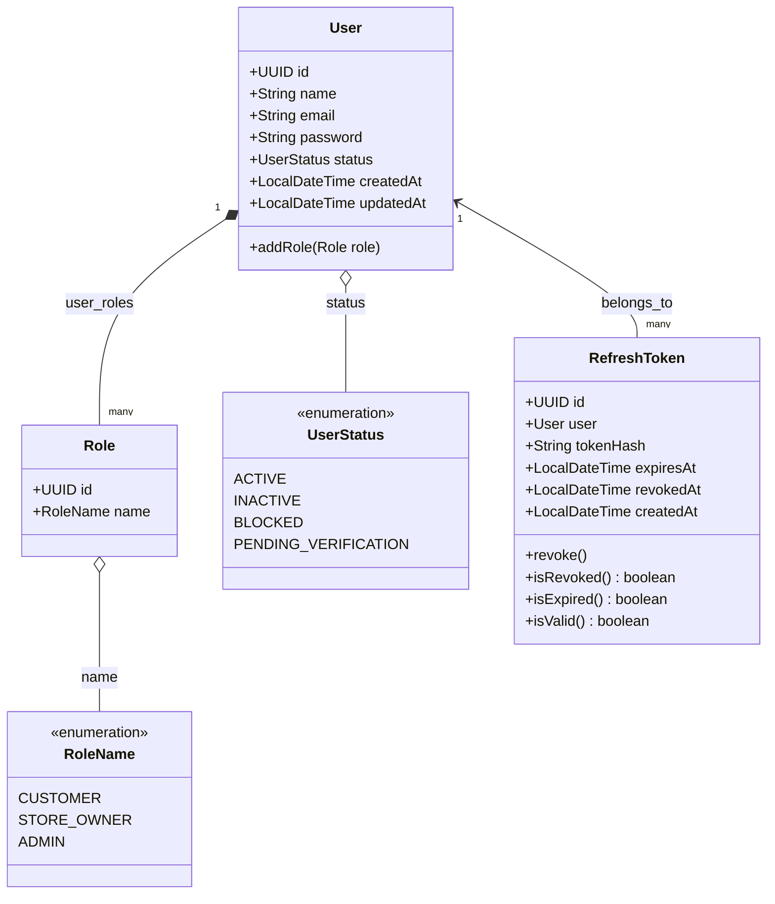

# 🏗️ Arquitetura e Estrutura do Código - Auth Service

Este documento detalha minuciosamente a arquitetura de software, a organização modular dos pacotes, o catálogo completo de componentes Spring (Beans, Services, Repositories, Controllers, DTOs, Enums) e o modelo de dados do **Auth Service**.

---

## 1. Visão Geral da Arquitetura

O **Auth Service** é o microsserviço central de identidade, autenticação e autorização do ecossistema **Entrego**. Ele foi projetado sob os seguintes pilares de engenharia:

- **Autenticação Stateless via JWT**: Todo o tráfego autenticado utiliza tokens JWT auto-contidos assinados assimetricamente (RSA SHA-256), eliminando estado de sessão HTTP no servidor.
- **Isolamento de Responsabilidade por Pacotes Temáticos**: O código é organizado por capacidades e domínios verticais (`auth`, `user`, `role`, `token`, `security`, `exceptions`), promovendo alta coesão e baixo acoplamento.
- **Imutabilidade e Segurança de Tipos**: DTOs, configurações e payloads de erro são modelados com **Java Records**.
- **Persistência Relacional Segura**: Schema versionado exclusivamente via migrações **Flyway**, com validação estrita do Hibernate em tempo de inicialização (`ddl-auto: validate`).
- **Segurança Defensiva em Camadas**: Criptografia de senhas com `BCryptPasswordEncoder`, tokens de atualização (Refresh Tokens) com hashing SHA-256 em repouso e controle de acesso granular baseado em papéis (RBAC).

---

## 2. Árvore Completa do Projeto

Abaixo está o mapeamento de todos os arquivos e diretórios do serviço:

```text
auth-service/
├── .mvn/
│   └── wrapper/
│       ├── maven-wrapper.jar
│       └── maven-wrapper.properties
├── docs/
│   ├── api-endpoints.md             # Especificação minuciosa de endpoints REST e cURL
│   ├── architecture-and-structure.md # Arquitetura, pacotes, beans e componentes (este arquivo)
│   ├── database-and-migrations.md   # Schema do PostgreSQL, Flyway e modelo ER
│   ├── error-handling.md            # Tratamento global de exceções e catálogo de erros
│   └── security-and-jwt.md          # Criptografia, JWT assimétrico, RBAC e rotação de tokens
├── src/
│   ├── main/
│   │   ├── java/
│   │   │   └── br/com/icaroteodoro/entrego/auth/
│   │   │       ├── AuthServiceApplication.java         # Classe principal (Spring Boot Entrypoint)
│   │   │       │
│   │   │       ├── auth/                               # Módulo de Autenticação & Sessão
│   │   │       │   ├── AuthController.java             # Endpoints /auth/login, refresh, logout, me, testes
│   │   │       │   ├── AuthService.java                # Lógica de login, refresh rotativo, logout e introspecção
│   │   │       │   └── dtos/
│   │   │       │       ├── LoginRequestDTO.java        # Credenciais de entrada (email, senha)
│   │   │       │       ├── LoginResponseDTO.java       # Tokens e expiração emitidos
│   │   │       │       ├── LogoutRequestDTO.java       # Token a ser revogado
│   │   │       │       ├── MeResponseDTO.java          # Dados do usuário autenticado extraídos do token
│   │   │       │       └── RefreshTokenRequestDTO.java # Refresh token para renovação
│   │   │       │
│   │   │       ├── exceptions/                         # Módulo de Tratamento Global de Erros
│   │   │       │   ├── ApiError.java                   # Record com payload padronizado de erro HTTP
│   │   │       │   ├── GlobalExceptionHandler.java     # @RestControllerAdvice mapeando exceções para HTTP status
│   │   │       │   └── InvalidRefreshTokenException.java # Exceção disparada por token inválido/expirado
│   │   │       │
│   │   │       ├── role/                               # Módulo de Papéis e Permissões (RBAC)
│   │   │       │   ├── Role.java                       # Entidade JPA mapeando a tabela 'roles'
│   │   │       │   ├── RoleName.java                   # Enum com os papéis do sistema
│   │   │       │   └── RoleRepository.java             # Acesso aos dados de papéis
│   │   │       │
│   │   │       ├── security/                           # Módulo de Configuração de Segurança e Criptografia
│   │   │       │   ├── JwtConfig.java                  # Declaração dos Beans de chaves RSA e Nimbus Encoders
│   │   │       │   ├── JwtProperties.java              # Binding tipado das propriedades security.jwt
│   │   │       │   ├── JwtService.java                 # Geração e montagem do Access Token assinado
│   │   │       │   └── SecurityConfig.java             # Filtros de segurança HTTP, stateless e RBAC
│   │   │       │
│   │   │       ├── token/                              # Módulo de Ciclo de Vida do Refresh Token
│   │   │       │   ├── RefreshToken.java               # Entidade JPA mapeando a tabela 'refresh_tokens'
│   │   │       │   ├── RefreshTokenRepository.java     # Busca de tokens pelo hash SHA-256
│   │   │       │   └── RefreshTokenService.java        # Geração criptográfica, hashing e validação
│   │   │       │
│   │   │       └── user/                               # Módulo de Gestão de Usuários
│   │   │           ├── User.java                       # Entidade JPA mapeando a tabela 'users'
│   │   │           ├── UserController.java             # Endpoint /auth/register
│   │   │           ├── UserRepository.java             # Acesso ao banco de usuários
│   │   │           ├── UserService.java                # Regras de cadastro, verificação e codificação de senha
│   │   │           ├── UserStatus.java                 # Enum de estados da conta do usuário
│   │   │           └── dtos/
│   │   │               ├── CreateUserRequestDTO.java   # Payload de registro (nome, email, senha)
│   │   │               └── UserResponseDTO.java        # Payload de resposta de usuário cadastrado
│   │   │
│   │   └── resources/
│   │       ├── application.properties                  # Propriedade de nome da aplicação
│   │       ├── application.yml                         # Configuração principal (DB, JWT, Port, Hibernate)
│   │       ├── db/
│   │       │   └── migration/
│   │       │       └── V1__create_users_table.sql      # DDL inicial e seed de roles
│   │       └── keys/
│   │           ├── private.pem                         # Chave privada RSA (PKCS#8) para assinatura JWT
│   │           └── public.pem                          # Chave pública RSA (X.509) para validação JWT
│   │
│   └── test/
│       └── java/
│           └── br/com/icaroteodoro/entrego/auth/
│               └── AuthServiceApplicationTests.java    # Teste de inicialização de contexto Spring
├── mvnw                                                # Script Maven Wrapper para Unix/Linux/macOS
├── mvnw.cmd                                            # Script Maven Wrapper para Windows
├── pom.xml                                             # Gerenciador de dependências e build Maven
└── README.md                                           # Guia mestre do repositório
```

---

## 3. Decomposição Detalhada dos Pacotes (Módulos Internos)

### 3.1. Pacote `br.com.icaroteodoro.entrego.auth`
- **Finalidade**: Ponto de entrada do serviço.
- **Classes**:
  - `AuthServiceApplication`: Inicializa a aplicação Spring Boot com `@SpringBootApplication`. Configura o escaneamento de componentes, auto-configuração do Spring Boot e bootstrap do servidor embutido na porta `8081`.

---

### 3.2. Pacote `br.com.icaroteodoro.entrego.auth.auth`
- **Finalidade**: Gerencia o ciclo de vida da autenticação, fluxos de login com verificação de credenciais, rotação de tokens, logout e verificação de perfil autenticado.
- **Classes e DTOs**:
  - `AuthController`: Controlador REST que expõe os endpoints públicos `/auth/login`, `/auth/refresh`, `/auth/logout` e os endpoints protegidos `/auth/me`, `/auth/customer-role-test` e `/auth/admin-role-test`.
  - `AuthService`: Orquestra o processo de autenticação. Realiza a busca do usuário por e-mail ignorando maiúsculas/minúsculas, checa a senha via `PasswordEncoder`, valida o status ativo (`UserStatus.ACTIVE`), solicita a geração do JWT ao `JwtService` e a emissão do Refresh Token ao `RefreshTokenService`.
  - `LoginRequestDTO`: Record contendo `email` e `password` com validações `@NotBlank` e `@Email`.
  - `LoginResponseDTO`: Record retornado ao cliente com `accessToken`, `refreshToken`, `expiresIn` (em segundos) e `tokenType` (`"Bearer"`).
  - `LogoutRequestDTO`: Record com o `refreshToken` a ser revogado.
  - `MeResponseDTO`: Record contendo `id`, `name`, `email` e a lista `roles` do usuário autenticado.
  - `RefreshTokenRequestDTO`: Record contendo o `refreshToken` opaco para renovação.

---

### 3.3. Pacote `br.com.icaroteodoro.entrego.auth.user`
- **Finalidade**: Domínio responsável pelo ciclo de vida das contas de usuário (cadastro, persistência e estados).
- **Classes e DTOs**:
  - `User`: Entidade JPA principal mapeada para a tabela `users`. Contém `id` (UUID), `name`, `email` (único), `password` (hasheado), relacionamento many-to-many com `Role`, `status` (`UserStatus`), além de timestamps auditáveis `createdAt` e `updatedAt`.
  - `UserStatus`: Enum que define os estados possíveis da conta: `ACTIVE`, `INACTIVE`, `BLOCKED`, `PENDING_VERIFICATION`.
  - `UserRepository`: Interface `JpaRepository<User, UUID>` com métodos de consulta derivados:
    - `findByEmailIgnoreCase(String email)`: Busca usuário por e-mail sem distinção de caixa alta/baixa.
    - `existsUserByEmail(String email)`: Checagem rápida de existência para evitar duplicidade.
  - `UserService`: Serviço de negócio para criação de usuários. Checa existência prévia de e-mail, associa automaticamente a role padrão `CUSTOMER`, codifica a senha com BCrypt e persiste a entidade.
  - `UserController`: Controlador REST que expõe o endpoint de cadastro público `POST /auth/register`.
  - `CreateUserRequestDTO`: Record de entrada para registro com `@NotBlank`, `@Size` e `@Email`.
  - `UserResponseDTO`: Record retornado após registro contendo `id`, `name` e `email`.

---

### 3.4. Pacote `br.com.icaroteodoro.entrego.auth.role`
- **Finalidade**: Modelo de autorização RBAC (Role-Based Access Control) que estabelece as permissões e níveis de acesso no sistema.
- **Classes e Enums**:
  - `Role`: Entidade JPA mapeada para a tabela `roles`. Possui `id` (UUID) e `name` (`RoleName`) único.
  - `RoleName`: Enum que define os perfis de acesso:
    - `CUSTOMER`: Cliente final que faz pedidos na plataforma.
    - `STORE_OWNER`: Lojista ou estabelecimento parceiro que gerencia catálogo e pedidos.
    - `ADMIN`: Administrador geral da plataforma com privilégios irrestritos.
  - `RoleRepository`: Interface `JpaRepository<Role, UUID>` com método de busca `findByName(RoleName name)`.

---

### 3.5. Pacote `br.com.icaroteodoro.entrego.auth.token`
- **Finalidade**: Gerenciamento de segurança para emissão, validação, rotação e revogação de Refresh Tokens.
- **Classes**:
  - `RefreshToken`: Entidade JPA mapeando a tabela `refresh_tokens`. Armazena o `user_id` (associação `ManyToOne`), `tokenHash` (hash SHA-256 do token gerado), `expiresAt`, `revokedAt` e `createdAt`. Possui métodos de domínio para verificação de validade:
    - `revoke()`: Registra o timestamp atual em `revokedAt`.
    - `isRevoked()`: Retorna se o token já foi explicitamente revogado.
    - `isExpired()`: Compara a data de expiração com o horário atual.
    - `isValid()`: Retorna verdadeiro somente se não estiver expirado e não estiver revogado.
  - `RefreshTokenRepository`: Interface `JpaRepository<RefreshToken, UUID>` com consulta customizada `findByTokenHash(String tokenHash)`.
  - `RefreshTokenService`: Componente de segurança criptográfica.
    - Gera strings aleatórias criptograficamente seguras com `SecureRandom` (32 bytes em Base64 URL-safe).
    - Aplica algoritmo **SHA-256** no token antes de persistir no banco, garantindo que mesmo um dump do banco não exponha tokens utilizáveis.
    - Executa validação de integridade e temporalidade.
    - Executa a revogação explícita de tokens (logout ou rotação).

---

### 3.6. Pacote `br.com.icaroteodoro.entrego.auth.security`
- **Finalidade**: Configuração central do Spring Security 6/7, processamento de chaves RSA assimétricas, decodificadores/codificadores Nimbus JOSE e geração de claims de Access Token.
- **Classes e Records**:
  - `SecurityConfig`: Habilita segurança web e de métodos (`@EnableWebSecurity`, `@EnableMethodSecurity`). Define a cadeia de filtros `SecurityFilterChain`:
    - Desabilita CSRF (aplicação estritamente stateless).
    - Configura política de criação de sessão como `SessionCreationPolicy.STATELESS`.
    - Libera as rotas públicas de autenticação (`/auth/register`, `/auth/login`, `/auth/refresh`, `/auth/logout`).
    - Exige autenticação para qualquer outra requisição.
    - Configura o OAuth2 Resource Server para validar tokens JWT utilizando o `JwtAuthenticationConverter`.
  - `JwtConfig`: Lê as chaves `private.pem` e `public.pem` do classpath, converte de formato PEM (Base64 PKCS#8 e X.509) para instâncias `RSAPrivateKey` e `RSAPublicKey`, e registra os beans `JwtEncoder` e `JwtDecoder` baseados na biblioteca Nimbus.
  - `JwtProperties`: Record anotado com `@ConfigurationProperties(prefix = "security.jwt")` para binding automático de propriedades: caminhos das chaves pública/privada, issuer (`entrego-auth`), tempo de expiração do access token (`15m`) e do refresh token (`30d`).
  - `JwtService`: Serviço especializado em construir e assinar o JWT (Access Token). Define as claims `iss`, `sub` (ID do usuário), `iat`, `exp` (+15 minutos) e o array customizado `roles` com os nomes das roles associadas ao usuário.

---

### 3.7. Pacote `br.com.icaroteodoro.entrego.auth.exceptions`
- **Finalidade**: Interceptação global de falhas da API e padronização das respostas HTTP de erro.
- **Classes**:
  - `ApiError`: Record imutável que padroniza o corpo de erro HTTP com os campos: `status` (int), `error` (descrição HTTP), `message` (mensagem clara da causa), `path` (URI requisitada) e `timestamp` (`LocalDateTime`).
  - `GlobalExceptionHandler`: Classe anotada com `@RestControllerAdvice` que captura e trata:
    - `InvalidRefreshTokenException` -> Retorna HTTP 401 Unauthorized.
    - `BadCredentialsException` -> Retorna HTTP 401 Unauthorized com mensagem genérica de segurança `"Invalid email or password"`.
    - `DisabledException` -> Retorna HTTP 403 Forbidden se a conta não estiver com status `ACTIVE`.
    - `MethodArgumentNotValidException` -> Retorna HTTP 400 Bad Request com o primeiro campo violado e a respectiva mensagem de validação do Bean Validation.
  - `InvalidRefreshTokenException`: Exceção unchecked de domínio lançada quando um refresh token não existe, já expirou ou foi previamente revogado.

---

## 4. Catálogo Completo de Componentes do Spring

### 4.1. Beans de Configuração (`@Bean`)

| Bean | Retorno | Classe de Origem | Finalidade |
| :--- | :--- | :--- | :--- |
| `securityFilterChain` | `SecurityFilterChain` | `SecurityConfig` | Define as regras de autorização de requisições HTTP, desabilita CSRF, fixa sessão stateless e configura o Resource Server JWT. |
| `passwordEncoder` | `PasswordEncoder` | `SecurityConfig` | Instancia o `BCryptPasswordEncoder` utilizado no hashing e na verificação das senhas de usuários. |
| `jwtAuthenticationConverter` | `JwtAuthenticationConverter` | `SecurityConfig` | Converte o claim `"roles"` do payload JWT em Granted Authorities do Spring Security com o prefixo `"ROLE_"`. |
| `rsaPublicKey` | `RSAPublicKey` | `JwtConfig` | Carrega o arquivo `public.pem`, decodifica a especificação X.509 e disponibiliza a chave pública para validação de JWTs. |
| `rsaPrivateKey` | `RSAPrivateKey` | `JwtConfig` | Carrega o arquivo `private.pem`, decodifica a especificação PKCS#8 e disponibiliza a chave privada para assinatura de JWTs. |
| `jwtEncoder` | `JwtEncoder` | `JwtConfig` | Instancia o codificador Nimbus JWT configurado com o par de chaves RSA assimétricas. |
| `jwtDecoder` | `JwtDecoder` | `JwtConfig` | Instancia o decodificador Nimbus JWT configurado com a chave pública RSA para validação dos tokens recebidos no Resource Server. |

---

### 4.2. Serviços de Negócio (`@Service`)

| Serviço | Dependências Injetadas | Principais Responsabilidades |
| :--- | :--- | :--- |
| `AuthService` | `UserRepository`, `PasswordEncoder`, `JwtService`, `JwtProperties`, `RefreshTokenService` | Executa o fluxo de login com checagem de senha e status, rotação atômica de refresh token no endpoint de refresh, revogação no logout e busca de dados para o `/auth/me`. |
| `UserService` | `UserRepository`, `PasswordEncoder`, `RoleRepository` | Cria novos usuários, valida unicidade de e-mail, atribui papel padrão `CUSTOMER` e persiste senha hasheada com BCrypt. |
| `RefreshTokenService` | `RefreshTokenRepository`, `JwtProperties` | Gera strings seguras de 32 bytes via `SecureRandom`, calcula hash SHA-256, salva entidade `RefreshToken`, valida e revoga tokens existentes. |
| `JwtService` | `JwtEncoder` | Constrói claims JWT (issuer, sub, exp, iat, roles) e assina o Access Token com validade de 15 minutos via chave RSA privada. |

---

### 4.3. Repositórios de Dados (`@Repository`)

| Repositório | Entidade | Métodos de Consulta Notáveis |
| :--- | :--- | :--- |
| `UserRepository` | `User` (UUID) | - `Optional<User> findByEmailIgnoreCase(String email)`<br>- `boolean existsUserByEmail(String email)` |
| `RoleRepository` | `Role` (UUID) | - `Optional<Role> findByName(RoleName name)` |
| `RefreshTokenRepository` | `RefreshToken` (UUID) | - `Optional<RefreshToken> findByTokenHash(String tokenHash)` |

---

### 4.4. Controladores REST (`@RestController`)

| Controlador | Rota Base | Endpoints Expostos |
| :--- | :--- | :--- |
| `UserController` | `/auth` | `POST /register` (Cadastro de novos usuários) |
| `AuthController` | `/auth` | `POST /login` (Autenticação)<br>`POST /refresh` (Rotação de refresh token)<br>`POST /logout` (Revogação de token)<br>`GET /me` (Perfil autenticado)<br>`GET /customer-role-test` (Teste Role CUSTOMER)<br>`GET /admin-role-test` (Teste Role ADMIN) |

---

### 4.5. Enums do Domínio

#### `RoleName`
Representa os níveis de privilégio atribuídos às contas de usuários no sistema:
- `CUSTOMER`: Usuário comum / cliente da aplicação.
- `STORE_OWNER`: Proprietário ou operador de loja / restaurante parceiro.
- `ADMIN`: Administrador da plataforma com permissões operacionais completas.

#### `UserStatus`
Representa o ciclo de vida e estado operacional da conta:
- `ACTIVE`: Conta apta para login e emissão de tokens.
- `INACTIVE`: Conta desativada voluntariamente ou temporariamente desabilitada.
- `BLOCKED`: Conta bloqueada por questões de segurança ou violação de termos.
- `PENDING_VERIFICATION`: Conta recém-criada pendente de confirmação de e-mail/identidade.

---

## 5. Diagrama de Classes e Relacionamentos do Domínio


