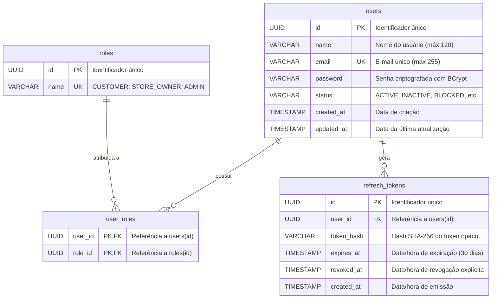

# 🗄️ Banco de Dados e Migrações Flyway - Auth Service

Este documento detalha o modelo relacional de dados, o versionamento de schema com Flyway, a política de DDL do Hibernate, o dicionário de dados das tabelas e as restrições de integridade do **Auth Service**.

---

## 1. Visão Geral da Camada de Persistência

- **SGBD**: PostgreSQL 17
- **Database de Desenvolvimento**: `entrego_auth` (`jdbc:postgresql://localhost:5432/entrego_auth`)
- **Database Exclusivo de Testes**: `entrego_auth_test` (`jdbc:postgresql://localhost:5432/entrego_auth_test`)
  - Configurado em `src/test/resources/application.yml`
  - Isolamento completo: execuções de testes automatizados nunca alteram ou apagam os dados cadastrados no banco de desenvolvimento.
- **Ferramenta de Migração**: Flyway (`spring-boot-starter-flyway` + `flyway-database-postgresql`)
- **Estratégia de DDL do Hibernate**: `validate` (`spring.jpa.hibernate.ddl-auto: validate`)
  - O Hibernate **não** altera nem cria tabelas em tempo de execução. O Flyway é o único responsável pelo ciclo de vida do schema DDL em ambos os ambientes.
  - Se houver divergência entre as anotações JPA das entidades Java e as colunas do PostgreSQL, a aplicação falha preventivamente no startup.

---

## 2. Diagrama Entidade-Relacionamento (ERD)



---

## 3. Dicionário de Dados das Tabelas

### 3.1. Tabela `users`
Armazena as contas de usuário do sistema.

| Coluna | Tipo SQL | Nulo? | Padrão | Restrições / Chaves | Descrição |
| :--- | :--- | :--- | :--- | :--- | :--- |
| `id` | `UUID` | Não | - | `PRIMARY KEY` | Identificador único da conta. |
| `name` | `VARCHAR(120)` | Não | - | - | Nome completo do usuário. |
| `email` | `VARCHAR(255)` | Não | - | `UNIQUE (uk_users_email)` | E-mail para login e contato. |
| `password` | `VARCHAR(255)` | Não | - | - | Hash BCrypt da senha do usuário. |
| `status` | `VARCHAR(30)` | Não | - | - | Estado da conta: `ACTIVE`, `INACTIVE`, `BLOCKED`, `PENDING_VERIFICATION`. |
| `created_at` | `TIMESTAMP` | Não | `CURRENT_TIMESTAMP` | - | Data e hora em que o registro foi inserido. |
| `updated_at` | `TIMESTAMP` | Não | `CURRENT_TIMESTAMP` | - | Data e hora da última modificação. |

---

### 3.2. Tabela `roles`
Armazena os papéis de controle de acesso (RBAC).

| Coluna | Tipo SQL | Nulo? | Padrão | Restrições / Chaves | Descrição |
| :--- | :--- | :--- | :--- | :--- | :--- |
| `id` | `UUID` | Não | - | `PRIMARY KEY` | Identificador único do papel. |
| `name` | `VARCHAR(50)` | Não | - | `UNIQUE (uk_roles_name)` | Nome da role: `CUSTOMER`, `STORE_OWNER`, `ADMIN`. |

---

### 3.3. Tabela Associativa `user_roles`
Mapeia a relação muitos-para-muitos (`N:N`) entre usuários e seus papéis.

| Coluna | Tipo SQL | Nulo? | Padrão | Restrições / Chaves | Descrição |
| :--- | :--- | :--- | :--- | :--- | :--- |
| `user_id` | `UUID` | Não | - | `PK, FK -> users(id)` | Identificador do usuário. |
| `role_id` | `UUID` | Não | - | `PK, FK -> roles(id)` | Identificador da role atribuída. |

- **Chave Primária Composta**: `PRIMARY KEY (user_id, role_id)`.
- Garante que o mesmo papel não possa ser duplicado para o mesmo usuário.

---

### 3.4. Tabela `refresh_tokens`
Armazena os tokens de longa duração emitidos para manter sessões ativas com rotação e revogação.

| Coluna | Tipo SQL | Nulo? | Padrão | Restrições / Chaves | Descrição |
| :--- | :--- | :--- | :--- | :--- | :--- |
| `id` | `UUID` | Não | - | `PRIMARY KEY` | Identificador único da sessão do token. |
| `user_id` | `UUID` | Não | - | `FK -> users(id)` | Usuário proprietário do token. |
| `token_hash` | `VARCHAR(255)` | Não | - | - | Hash SHA-256 do token opaco gerado. |
| `expires_at` | `TIMESTAMP` | Não | - | - | Data e hora em que o token perde validade (30 dias). |
| `revoked_at` | `TIMESTAMP` | Sim | `NULL` | - | Preenchido quando o token é invalidado (logout ou rotação). |
| `created_at` | `TIMESTAMP` | Não | `CURRENT_TIMESTAMP` | - | Data e hora em que o token foi criado. |

---

## 4. Histórico de Migrações Flyway

Todas as migrações estão localizadas em: `src/main/resources/db/migration/`.

### Migração `V1__create_users_table.sql`
- **Data de Criação**: Versão inicial do schema.
- **Operações Realizadas**:
  1. Criação das tabelas `users`, `roles`, `user_roles` e `refresh_tokens`.
  2. Definição das chaves primárias e chaves estrangeiras com integridade referencial:
     - `fk_user_roles_user` -> `users(id)`
     - `fk_user_roles_role` -> `roles(id)`
     - `fk_refresh_token_user` -> `users(id)`
  3. Definição de restrições de unicidade:
     - `uk_users_email` em `users(email)`
     - `uk_roles_name` em `roles(name)`
  4. **Carga Inicial (Seed Data)**:
     ```sql
     INSERT INTO roles (id, name)
     VALUES
         (gen_random_uuid(), 'CUSTOMER'),
         (gen_random_uuid(), 'STORE_OWNER'),
         (gen_random_uuid(), 'ADMIN');
     ```

---

## 5. Boas Práticas e Decisões de Modelagem

1. **Uso de UUIDs**: Todas as entidades utilizam `UUID` (gerados com `GenerationType.UUID` no JPA ou `gen_random_uuid()` no PostgreSQL). Isso previne enumeração sequencial de IDs por usuários maliciosos e simplifica a integração distribuída entre microsserviços.
2. **Defesa em Profundidade para Refresh Tokens**: Armazenamento apenas de `token_hash` em vez do token legível.
3. **Auditoria Temporal Automática**: As entidades contam com anotações `@CreationTimestamp` e `@UpdateTimestamp` do Hibernate gerenciando os campos `createdAt` e `updatedAt`.
4. **Busca Case-Insensitive**: O repositório `UserRepository` utiliza o método `findByEmailIgnoreCase`, garantindo que variações de caixa de texto (`Usuario@Email.com` vs `usuario@email.com`) identifiquem a mesma conta sem ambiguidades.
