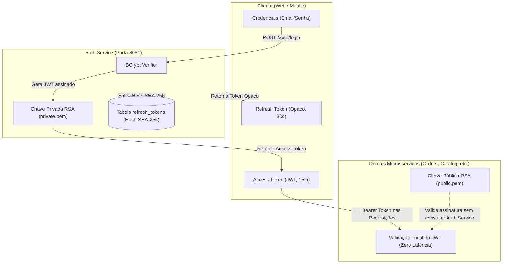
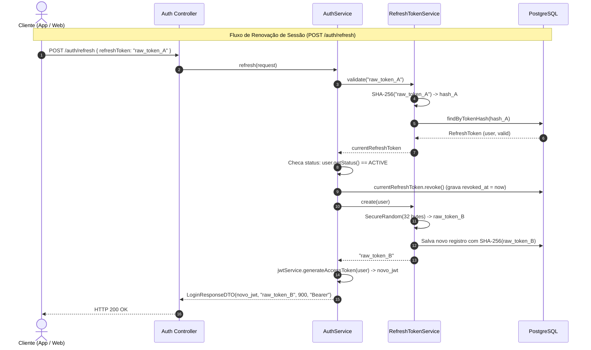
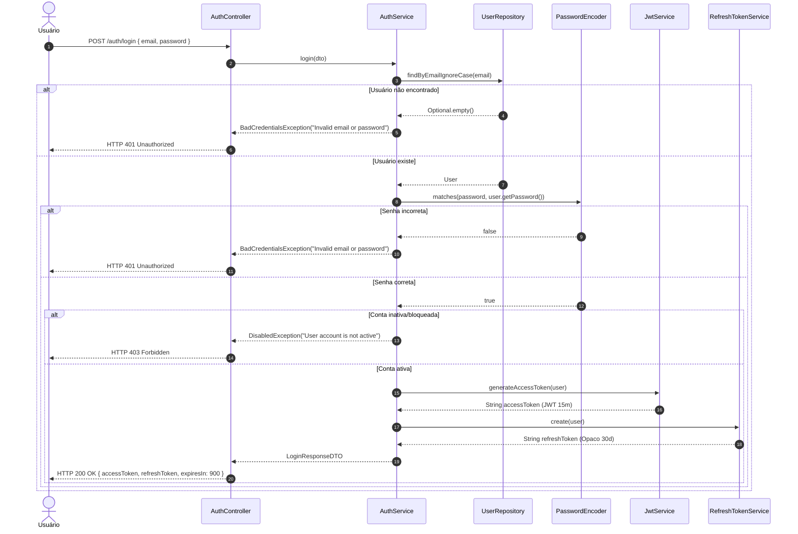
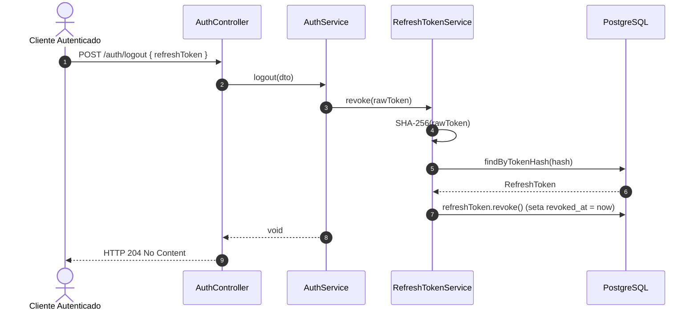

# 🔐 Segurança, Criptografia e Autenticação JWT

Este documento descreve as decisões de segurança, arquitetura criptográfica, modelo de autorização (RBAC), ciclo de vida do JWT (JSON Web Token) e padrão de segurança avançado para Refresh Tokens no **Auth Service**.

---

## 1. Princípios e Decisões de Segurança

O **Auth Service** foi projetado para atuar como o Provedor de Identidade (IdP) e Servidor de Autenticação confiável do ecossistema de microsserviços **Entrego**. Para garantir máxima resiliência e integridade, foram adotadas as seguintes decisões arquiteturais:



---

## 2. Autenticação Assimétrica com Par de Chaves RSA (RS256)

### 2.1. Por que Criptografia Assimétrica?
Diferente da assinatura simétrica (HMAC com chave secreta compartilhada `HS256`), onde todos os microsserviços precisam conhecer o mesmo segredo compartilhado (aumentando o risco de comprometimento se qualquer serviço vazar o segredo), o **Auth Service** adota **criptografia de chave pública/privada (RSA 2048-bit / RS256)**:

1. **Chave Privada (`private.pem`)**:
   - Reside **exclusivamente** no `auth-service`.
   - Utilizada pelo `JwtEncoder` para assinar digitalmente cada Access Token emitido.
   - Mesmo que um invasor comprometa outro microsserviço, ele jamais terá acesso à chave privada para emitir tokens forjados.
2. **Chave Pública (`public.pem`)**:
   - Pode ser distribuída com segurança para qualquer microsserviço do ecossistema **Entrego** (ou exposta via endpoint JWKS em futuras versões).
   - Utilizada pelo `JwtDecoder` para verificar a autenticidade e integridade dos tokens nas requisições recebidas.
   - Permite que outros serviços validem as credenciais dos usuários com **latência zero** (sem fazer chamadas HTTP ou consultas no banco do `auth-service`).

### 2.2. Carregamento e Conversão de Chaves no Spring
A classe `JwtConfig` decodifica as chaves em formato PEM (PKCS#8 para privada e X.509 para pública) armazenadas em `src/main/resources/keys/`:

```java
// Leitura da chave pública (X.509)
byte[] decoded = Base64.getDecoder().decode(key);
X509EncodedKeySpec keySpec = new X509EncodedKeySpec(decoded);
KeyFactory keyFactory = KeyFactory.getInstance("RSA");
return (RSAPublicKey) keyFactory.generatePublic(keySpec);

// Leitura da chave privada (PKCS#8)
PKCS8EncodedKeySpec keySpec = new PKCS8EncodedKeySpec(decoded);
return (RSAPrivateKey) keyFactory.generatePrivate(keySpec);
```

As chaves são integradas diretamente ao ecossistema Nimbus JOSE (`NimbusJwtEncoder` e `NimbusJwtDecoder`), garantindo conformidade estrita com o padrão RFC 7519.

---

## 3. Estrutura e Anatomia do Access Token (JWT)

O **Access Token** é auto-contido, sem estado de sessão HTTP no servidor (`SessionCreationPolicy.STATELESS`), e tem validade intencionalmente curta: **15 minutos**.

### 3.1. Headers
```json
{
  "alg": "RS256",
  "typ": "JWT"
}
```

### 3.2. Payload (Claims)
Montado programaticamente pela classe `JwtService`:

```json
{
  "iss": "entrego-auth",
  "sub": "a1b2c3d4-e5f6-7a8b-9c0d-1e2f3a4b5c6d",
  "iat": 1774652400,
  "exp": 1774653300,
  "roles": [
    "CUSTOMER"
  ]
}
```

| Claim | Nome / Significado | Valor / Origem |
| :--- | :--- | :--- |
| `iss` | Issuer (Emissor) | `"entrego-auth"` (configurável em `security.jwt.issuer`) |
| `sub` | Subject (Assunto) | ID único do usuário no formato UUID (`user.getId().toString()`) |
| `iat` | Issued At (Momento de Emissão) | Timestamp Epoch em segundos (`Instant.now()`) |
| `exp` | Expiration Time (Expiração) | Timestamp Epoch em segundos (+15 minutos via `now.plus(15, ChronoUnit.MINUTES)`) |
| `roles` | Roles (Papéis de Autorização) | Lista com os nomes dos perfis do usuário (`List<RoleName>`) |

---

## 4. Codificação e Proteção de Senhas (BCrypt)

As senhas dos usuários nunca são armazenadas em texto plano. O serviço utiliza o bean `BCryptPasswordEncoder`:

```java
@Bean
PasswordEncoder passwordEncoder() {
    return new BCryptPasswordEncoder();
}
```

### Características de Segurança do BCrypt:
- **Salting Criptográfico Automático**: O BCrypt gera um salt aleatório único de 16 bytes para cada senha antes de realizar a computação do hash. Isso impede ataques de dicionário e tabelas Rainbow.
- **Fator de Custo Adaptativo**: Possui fator de iterações ajustável, tornando o processo de cálculo de hash computacionalmente custoso para desacelerar ataques de força bruta por hardware especializado (GPU/ASIC).
- **Verificação Segura em Tempo Constante**: O método `passwordEncoder.matches(rawPassword, encodedPassword)` compara os valores evitando ataques de temporização (*timing attacks*).

---

## 5. Controle de Acesso Baseado em Papéis (RBAC)

O controle de autorização é implementado através do padrão **RBAC (Role-Based Access Control)** integrado ao Spring Security.

### 5.1. Mapeamento de Claims para Granted Authorities
Por padrão, o Spring Security procura por claims de escopo (`"scope"` ou `"scp"`). O `SecurityConfig` personaliza esse comportamento através do bean `JwtAuthenticationConverter`:

```java
@Bean
JwtAuthenticationConverter jwtAuthenticationConverter() {
    JwtGrantedAuthoritiesConverter authoritiesConverter = new JwtGrantedAuthoritiesConverter();
    authoritiesConverter.setAuthoritiesClaimName("roles");
    authoritiesConverter.setAuthorityPrefix("ROLE_");

    JwtAuthenticationConverter authenticationConverter = new JwtAuthenticationConverter();
    authenticationConverter.setJwtGrantedAuthoritiesConverter(authoritiesConverter);
    return authenticationConverter;
}
```

### 5.2. Efeito do Mapeamento
Quando o token contém:
```json
"roles": ["CUSTOMER", "ADMIN"]
```
O Spring Security extrai as seguintes autoridades de segurança no `SecurityContext`:
- `ROLE_CUSTOMER`
- `ROLE_ADMIN`

### 5.3. Segurança a Nível de Método (`@EnableMethodSecurity`)
Com a anotação `@EnableMethodSecurity` na classe `SecurityConfig`, os métodos dos controladores podem ser protegidos declarativamente:

```java
@GetMapping("/customer-role-test")
@PreAuthorize("hasRole('CUSTOMER')")
public String customerTest() {
    return "Customer authorized";
}

@GetMapping("/admin-role-test")
@PreAuthorize("hasRole('ADMIN')")
public String adminTest() {
    return "Admin authorized";
}
```

Caso um cliente autenticado apenas com o papel `CUSTOMER` tente acessar `/auth/admin-role-test`, o Spring Security nega o acesso automaticamente com **HTTP 403 Forbidden**.

---

## 6. Padrão Avançado de Refresh Token (RTR & Hashing)

Enquanto o Access Token é stateless e tem curta duração (15 minutos), o **Refresh Token** permite que a sessão do usuário permaneça ativa de forma segura por até **30 dias**, sem exigir que o usuário digite suas credenciais repetidamente.

### 6.1. Geração Criptograficamente Segura
O refresh token não é um JWT legível. Trata-se de uma string opaca de alta entropia gerada pelo `RefreshTokenService` usando `java.security.SecureRandom`:
- **32 bytes** de números pseudoaleatórios criptográficos (256 bits de entropia).
- Codificação em **Base64 URL-safe** sem preenchimento (`Base64.getUrlEncoder().withoutPadding()`).

### 6.2. Hashing em Repouso no Banco de Dados (SHA-256)
> [!IMPORTANT]
> **Prática de Segurança de Alto Nível**: O valor puro do refresh token entregue ao cliente **NUNCA** é salvo no banco de dados. 
> Apenas o hash **SHA-256** do token é persistido na coluna `token_hash` da tabela `refresh_tokens`.

**Vantagem Crítica**: Em caso de vazamento inadvertido do banco de dados (ex: backup exposto, injeção de SQL em outro serviço compartilhando base), nenhum invasor conseguirá utilizar os hashes armazenados para se passar por usuários legítimos, pois o algoritmo SHA-256 é unidirecional.

### 6.3. Rotação de Refresh Token (Refresh Token Rotation - RTR)
Para neutralizar o risco de interceptação de tokens, o serviço aplica **Refresh Token Rotation (RTR)** estrito durante o fluxo de renovação (`POST /auth/refresh`):

1. O cliente envia o `refreshToken` atual.
2. O serviço calcula o hash SHA-256 e localiza o registro no banco.
3. É validado se o token não expirou (`isExpired()`) e se não foi revogado (`isRevoked()`).
4. **Revogação Imediata**: O token atual é marcado como revogado (`revokedAt = LocalDateTime.now()`).
5. Um **NOVO Refresh Token** e um **NOVO Access Token** são gerados e retornados ao cliente.



### 6.4. Checagem em Tempo Real do Status da Conta (`UserStatus`)
Mesmo que um atacante obtenha um refresh token válido de 30 dias, se um administrador desativar ou bloquear a conta do usuário (`UserStatus.INACTIVE`, `BLOCKED` ou `PENDING_VERIFICATION`), a próxima tentativa de login ou refresh será imediatamente rejeitada com uma exceção `DisabledException` (**HTTP 403 Forbidden**).

---

## 7. Diagramas de Sequência Detalhados

### 7.1. Fluxo de Login Inicial


### 7.2. Fluxo de Logout


---

## 8. Padronização de Falhas na Cadeia de Filtros do Spring Security

Por padrão, falhas de segurança disparadas **dentro da cadeia de filtros** do Spring Security (como tentar acessar uma rota protegida sem token, enviar um token expirado, assinatura adulterada ou violar regras de `@PreAuthorize`) ocorrem antes de a requisição atingir a camada de controladores (`@RestController`). Consequentemente, esses erros **não são capturados pelo `@RestControllerAdvice`**.

Para assegurar consistência arquitetural de 100% nas respostas de erro, o serviço registra componentes especializados:

### 8.1. `CustomAuthenticationEntryPoint` (HTTP 401 Unauthorized)
- **Quando atua**: Requisição em rota protegida sem cabeçalho `Authorization`, token Bearer malformado, token expirado ou assinatura RSA inválida.
- **Implementação**: Escreve o payload padronizado `ApiError` diretamente no `HttpServletResponse` com status `401 Unauthorized`:
```json
{
  "status": 401,
  "error": "Unauthorized",
  "message": "Full authentication is required to access this resource",
  "path": "/auth/me",
  "timestamp": "2026-09-26T18:00:00"
}
```

### 8.2. `CustomAccessDeniedHandler` (HTTP 403 Forbidden)
- **Quando atua**: O usuário está autenticado com sucesso via JWT, mas não possui a role necessária exigida pela rota ou anotação `@PreAuthorize` (ex: usuário `CUSTOMER` tentando acessar rota `@PreAuthorize("hasRole('ADMIN')")`).
- **Implementação**: Escreve o payload padronizado `ApiError` diretamente com status `403 Forbidden`:
```json
{
  "status": 403,
  "error": "Forbidden",
  "message": "Access is denied",
  "path": "/auth/admin-role-test",
  "timestamp": "2026-09-26T18:00:05"
}
```

Ambos os handlers são registrados tanto no `http.exceptionHandling()` quanto no `http.oauth2ResourceServer()` dentro do `SecurityConfig`.

---

## 9. Política Segura de Logs e Proteção de Dados Sensíveis

O **Auth Service** adota uma política rigorosa de logs defensivos (`@Slf4j`) para prevenir vazamento inadvertido de dados sensíveis em arquivos de log, agregadores (Elasticsearch, Loki, CloudWatch) e consoles de monitoramento:

### 🚫 O que NUNCA é registrado em log:
1. **Senhas em texto puro**: A senha enviada pelo cliente jamais aparece em logs de requisição, debug ou exceções.
2. **Hashes de senha (BCrypt)**: Hashes persistidos nunca são impressos em logs.
3. **Access Tokens (JWT)**: O token JWT puro nunca é exposto em mensagens informativas ou de depuração.
4. **Refresh Tokens opacos**: O valor do token gerado para o cliente nunca é logado.
5. **Hashes SHA-256 de refresh tokens**: Hashes calculados em memória não são expostos.

### ✅ O que é registrado de forma segura para auditoria:
- **E-mails de usuários**: Apenas para rastreabilidade de eventos (ex: `"User successfully registered with email: maria.silva@example.com"` ou `"Successful login for user: maria.silva@example.com"`).
- **IDs de usuários (UUID)**: Identificadores imutáveis para correlação em métricas (ex: `"Generated new refresh token for user ID: e2a3b174-8b89-..."`).
- **Caminhos de requisição e códigos HTTP**: Para monitoramento de tráfego e taxa de falhas.

